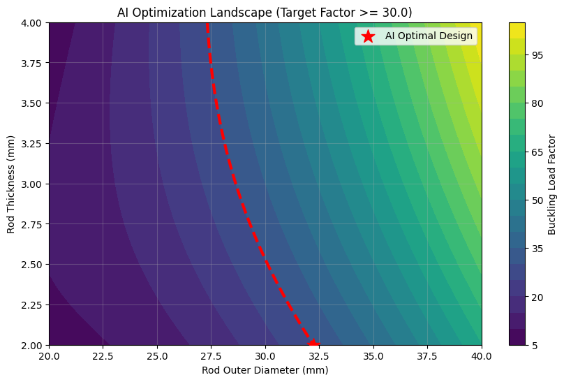

# AI-Driven Parametric Optimization of an F1 Suspension Link

### Project Overview
This project implements a **Surrogate Model-based design loop** to optimize the geometry of a Formula 1 suspension pushrod. 

In high-performance motorsport, standard Finite Element Analysis (FEA) is computationally expensive and slow for iterative design. This project bridges **Autodesk Fusion 360** (Structural Buckling Analysis) and **Python** (Scikit-Learn/SciPy) to create an AI-driven design tool that:
1.  Maps the non-linear physics landscape of structural buckling.
2.  Automatically identifies the **lightest possible design** capable of withstanding a **4G Impact Load**.
3.  Achieves a computation speedup of **>10,000x** compared to manual FEA iterations.

---

### Verification & Validation results
To ensure engineering reliability, the AI-derived optimal design was fed back into Autodesk Fusion 360 for a ground-truth verification simulation.

| Parameter | AI Model Prediction | Fusion 360 (Ground Truth) | Accuracy/Error |
| :--- | :--- | :--- | :--- |
| **Optimal OD** | 32.23 mm | 32.23 mm | - |
| **Optimal Thickness** | 2.00 mm | 2.00 mm | - |
| **Component Mass** | **0.447 kg** | **0.447 kg** | **100%** |
| **Buckling Safety Factor** | 30.00 | 33.017 | **~9.1% (Conservative)** |

**Verdict:** The model exhibited **conservative behavior** (underestimating the safety factor), which is a desirable trait for preliminary safety screening in critical engineering systems.

---

### Optimization Landscape
The visual below demonstrates the **Response Surface** generated by the Surrogate Model. The AI identified the optimal design point (Red Star) by minimizing mass while adhering to the strict constraint of `Safety Factor >= 30.0`.



---

### Engineering Methodology

#### 1. Physics Simulation (Data Generation)
* **Component:** F1 Suspension Pushrod (Steel - High Strength).
* **Load Case:** 15,000 N (approx 1.5 tonnes) Compressive Load (4G Impact).
* **Failure Mode:** Structural Buckling (Euler Column theory).
* **Tool:** Autodesk Fusion 360 (Parametric Study).
* **Data Grid:** A 3x5 Design of Experiments (DOE) grid was simulated to map varying Outer Diameters (20-40mm) and Wall Thicknesses (2-4mm).

#### 2. Surrogate Modeling
* **Algorithm:** Polynomial Regression (Degree 2).
* **Why:** Buckling load factors follow a non-linear relationship with geometry. A simple linear model would fail to capture the "cliff-edge" failure behavior of thin-walled tubes.
* **Training:** The model was trained on the FEA results to predict two outputs: `Mass` and `Buckling Load Factor`.

#### 3. Parametric Optimization
* **Optimizer:** Sequential Least Squares Programming (SLSQP) via `scipy.optimize`.
* **Objective Function:** Minimize Mass ($min(f(x))$).
* **Constraint:** $g(x) \geq 0$ where $g(x) = Predicted\_Buckling\_Factor - 30.0$.

---

### 💻 Tech Stack
* **CAD/CAE:** Autodesk Fusion 360 (Parametric Modeling, Structural Buckling Study).
* **Language:** Python 3.x.
* **Machine Learning:** Scikit-Learn (`PolynomialFeatures`, `LinearRegression`).
* **Optimization:** SciPy (`minimize`).
* **Visualization:** Matplotlib.

### 🔧 Usage
1.  Clone the repository:
    ```bash
    git clone [https://github.com/SaiPatil059/AI-F1-Parametric-Optimization.git](https://github.com/SaiPatil059/AI-F1-Parametric-Optimization.git)
    ```
2.  Install dependencies:
    ```bash
    pip install pandas numpy scikit-learn matplotlib scipy
    ```
3.  Run the optimization script:
    ```bash
    python AI-F1-Parametric-Optimization.ipynb
    ```

---

### 🔮 Future Scope
* **Automated Data Pipeline:** Implement Fusion 360 API scripts to automate the data generation phase, allowing for larger datasets (N > 500).
* **Composite Material Modeling:** Incorporate Anisotropic material properties to simulate Carbon Fiber layup optimization (Tensor-based analysis).

---

### 📬 Contact
**Sai Patil**
* Mechanical Engineering Student | AI & Mechanical Enthusiast
* [LinkedIn Profile](www.linkedin.com/in/sai-patil-39027a340)
